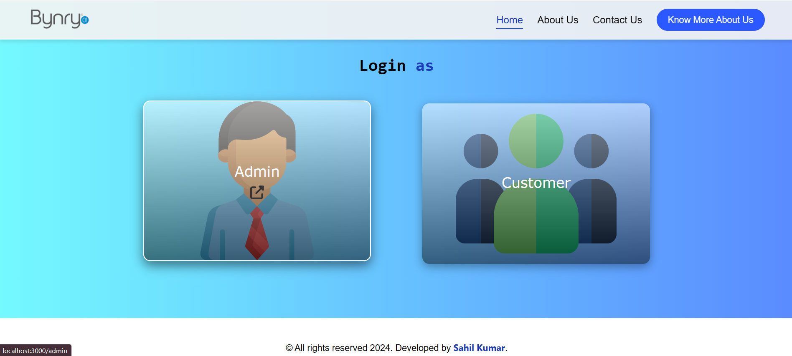
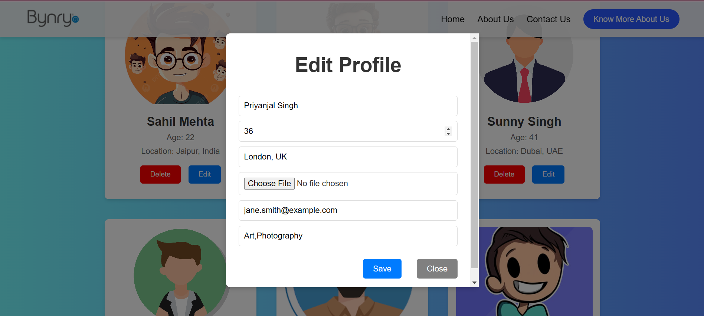
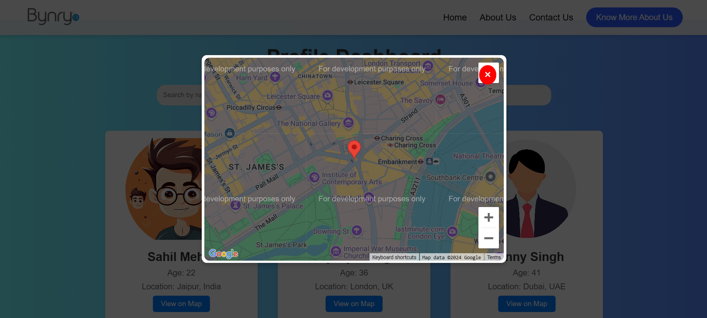

# Profile Management Web Application

[**View Live Deployment Here**](https://user-profile-management.vercel.app/)

---

## Overview

The **Profile Management Web Application** is a user-friendly platform that allows users to view, search, and interact with profiles. Each profile contains basic details and an interactive map showing its geographic location. The app is built using **React** and features responsive design, custom modals, and dynamic mapping functionality.

---

## Features

- **Profile List**: Displays a collection of profiles with key details like name, age, and location.
- **Interactive Map**: Dynamically shows the selected profile's address on a map.
- **Search Functionality**: Filter profiles seamlessly with debounced search.
- **Admin Panel**: Add, edit, or delete profiles efficiently.
- **Responsive Design**: Adapts to various devices, including smartphones and tablets.

---

## Screenshots

### Home Page


### Profile Page


### Interactive Map


---

## Technologies Used

- **Frontend**: React, JavaScript
- **State Management**: React (`useState`, `useMemo`, `useCallback`)
- **Styling**: Custom CSS for responsiveness
- **Mapping**: Google Maps API (or alternative)
- **Storage**: Local Storage for profile data persistence

---

## Installation

1. Clone the repository:

    ```bash
    git clone https://github.com/codeVcreator/user-profile-management.git
    ```

2. Navigate to the project directory:

    ```bash
    cd user-profile-management
    ```

3. Install the dependencies:

    ```bash
    npm install
    ```

4. Start the development server:

    ```bash
    npm start
    ```

5. Open your browser and visit [http://localhost:3000](http://localhost:3000) to view the app.

---

## Usage

- **View Profiles**: Browse through profiles with their names and key information.
- **Search Profiles**: Use the search bar to filter profiles dynamically.
- **View Profile Details**: Click on a profile to open a modal with detailed information and an interactive map.
- **Admin Panel**: Add, edit, or delete profiles through the intuitive admin interface.
- **Responsive Layout**: Experience the app seamlessly across mobile, tablet, and desktop devices.

---

## Future Improvements

- Integrate API-based real-time data for profiles.
- Implement authentication for admin access and profile management.
- Enhance the user interface for improved accessibility and user experience.
- Add pagination for large profile datasets.

---

[**View Live Deployment Here**](https://user-profile-management.vercel.app/)

---